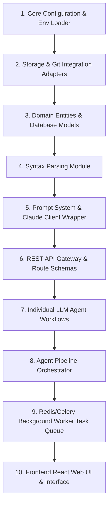

# Software Architecture Design: Autonomous Code Reviewer AI

This document details the production-ready architectural design for **Autonomous Code Reviewer AI**. The system uses a modular, asynchronous, API-first architecture designed to process repositories, detect code characteristics, run targeted analytical agents, and synthesize findings into downloadable reports.

---

## 1. High-Level System Architecture

The system uses a decoupled layout separating client UI, API Routing, Asynchronous Processing, and Agent Execution.

### System Topology Diagram
```text
      +--------------------------------------------------------+
      |                     React Frontend                     |
      +---------------------------+----------------------------+
                                  | HTTP REST / WebSockets
                                  v
      +--------------------------------------------------------+
      |                FastAPI API Gateway / Router            |
      +------------------+-------------------+-----------------+
                         |                   |
        Enqueue Job      v                   v Read Status / Reports
      +---------------------+             +---------------------+
      |    Celery Queue     |             |     PostgreSQL      |
      |   (Redis Broker)    |             |  (Metadata / State) |
      +----------+----------+             +----------+----------+
                 | Async                             ^
                 v Worker                            | DB Repository
      +----------+-----------------------------------+----------+
      |              Celery Background Worker Tasks            |
      |                                                        |
      |  1. Clone Repo / Extract ZIP to Local Workspace        |
      |  2. Execute Language Detection & Parsing               |
      |  3. Run Modular Agent Pipeline (DAG Execution)         |
      |  4. Compile Report (PDF/HTML/ZIP) -> Persistent S3     |
      +----------------------------+---------------------------+
                                   | HTTPS API Calls
                                   v
      +--------------------------------------------------------+
      |                  Claude 3.5 Sonnet API                 |
      +--------------------------------------------------------+
```

### Modular Agent Pipeline (DAG)
The analysis pipeline runs in a Directed Acyclic Graph (DAG) pattern within the worker task to ensure optimal speed and dependency satisfaction.

```text
                               +-----------------------------+
                               |     Local Workspace Path    |
                               +--------------+--------------+
                                              |
                                              v
                              +---------------+---------------+
                              |    Language Detection Agent   |
                              +---------------+---------------+
                                              |
                                              v
                              +---------------+---------------+
                              |      Code Parsing Agent       |
                              +---------------+---------------+
                                              |
                       +----------------------+----------------------+
                       |                                             |
                       v                                             v
       +---------------+---------------+             +---------------+---------------+
       |       Code Review Agent       |             |   Security Analysis Agent     |
       +---------------+---------------+             +---------------+---------------+
                       |                                             |
                       +----------------------+----------------------+
                                              | Aggregated Findings
                                              v
                              +---------------+---------------+
                              |    Code Improvement Agent     |
                              +---------------+---------------+
                                              |
                                              v
                              +---------------+---------------+
                              | Documentation Generator Agent |
                              +---------------+---------------+
                                              |
                                              v
                              +---------------+---------------+
                              |    Report Generator Agent     |
                              +---------------+---------------+
```

---

## 2. Production Folder Structure

This structure enforces **Clean Architecture** (Separation of Concerns) and **SOLID** principles, ensuring framework-agnostic domain logic.

```text
autonomous-code-reviewer/
├── backend/
│   ├── app/
│   │   ├── __init__.py
│   │   ├── main.py                # FastAPI Application Entrypoint
│   │   ├── core/                  # Global Configs, Settings & Constants
│   │   │   ├── config.py          # Pydantic BaseSettings (Env loader)
│   │   │   ├── security.py        # API Keys, CORS, Auth validations
│   │   │   └── exceptions.py      # Custom business-to-HTTP exception handlers
│   │   │
│   │   ├── domain/                # Enterprise Business Rules (Entities, pure logic)
│   │   │   ├── models/            # Domain Entities (Analysis, Issue, Diff, Report)
│   │   │   └── exceptions/        # Custom domain exceptions
│   │   │
│   │   ├── use_cases/             # Application Use Cases & Orchestration
│   │   │   ├── interfaces/        # Abstract adapter ports (SPIs)
│   │   │   │   ├── db_port.py     # Database operations interface
│   │   │   │   ├── storage_port.py# File storage (S3/Local) interface
│   │   │   │   ├── git_port.py    # Git operations interface
│   │   │   │   └── llm_port.py    # Claude Sonnet 4 model interface
│   │   │   ├── orchestrator.py    # Multi-agent execution DAG scheduler
│   │   │   └── analysis/          # Individual orchestrations (e.g. run_analysis_use_case)
│   │   │
│   │   ├── infrastructure/        # Frameworks & Drivers adapters (APIs, Clients)
│   │   │   ├── api/               # FastAPI controllers
│   │   │   │   ├── v1/
│   │   │   │   │   ├── endpoints/
│   │   │   │   │   │   ├── upload.py
│   │   │   │   │   │   ├── status.py
│   │   │   │   │   │   └── reports.py
│   │   │   │   │   └── router.py
│   │   │   │   └── schemas/       # Request/Response validation schemas
│   │   │   ├── database/          # SQLAlchemy ORM, Repositories, Migrations
│   │   │   ├── storage/           # Disk/AWS S3 local file manager adapter
│   │   │   ├── git/               # GitPython repository cloner adapter
│   │   │   ├── parser/            # Code parsing engine (Tree-Sitter / AST)
│   │   │   ├── report/            # PDF and zip compiler adapter
│   │   │   └── llm/               # Anthropic Claude 3.5 client & structured prompts
│   │   │
│   │   └── worker/                # Background worker layer
│   │       ├── celery_app.py      # Celery worker configuration
│   │       └── tasks.py           # Long-running async task wrappers
│   │
│   └── requirements.txt
├── frontend/                      # React SPA
│   ├── src/
│   │   ├── components/            # UI components (Upload, DiffViewer, ReportExport)
│   │   ├── hooks/                 # Reusable React hooks
│   │   ├── services/              # API Client (Axios/Fetch) wrappers
│   │   └── App.jsx
│   └── package.json
```

---

## 3. Required AI Agents Specification

### 1. Repository Upload Agent
*   **Responsibility**: Validates, clones, or extracts incoming source code into a temporary, isolated workspace folder.
*   **Input**: `git_url` (string) OR multipart file payload (ZIP format).
*   **Output**: Local filesystem absolute path to workspace folder; repository size metadata.
*   **Dependencies**: OS filesystem, Git CLI, ZIP compression/decompression utils.
*   **Failure Handling**: 
    *   *Invalid URL*: Returns HTTP `400 Bad Request`.
    *   *Network Timeout/Large Clone*: Restricts depth to `--depth=1` on retry; fails with code `408 Request Timeout` if clone exceeds 60 seconds.
    *   *Oversized ZIP*: Immediate rejection if payload size > 100MB (`413 Payload Too Large`).
*   **API Endpoint**: `POST /api/v1/analyses/upload`
*   **Scalability Notes**: Offloads active cloning and extraction processes to background workers to prevent thread blockages on the main API gateway.

### 2. Language Detection Agent
*   **Responsibility**: Traverses the cloned repository workspace, detects programming language distribution by file extensions/metadata, and identifies entrypoints.
*   **Input**: Workspace absolute path.
*   **Output**: Language distribution metadata map (e.g., `{"TypeScript": 0.82, "CSS": 0.18}`), primary language, identified stack (e.g., "Next.js").
*   **Dependencies**: Filesystem scanner, system language heuristics map.
*   **Failure Handling**: 
    *   *Unsupported codebase*: Falls back to matching general text files; updates state to warning but does not abort flow.
    *   *Infinite recursion (symbolic links)*: Maximum traversal depth set to 10 folders.
*   **API Endpoint**: *Internal use* (triggered directly inside worker pipeline).
*   **Scalability Notes**: Executes in milliseconds using local index cache; negligible memory foot-print.

### 3. Code Parsing Agent
*   **Responsibility**: Parses relevant source files into structured syntax segments (functions, class contexts, import mapping) and handles chunk partitioning to prevent context limit overflow.
*   **Input**: Workspace absolute path, primary language.
*   **Output**: Collection of analysis-ready text chunks structured with context mapping (file name, line ranges, class references).
*   **Dependencies**: Tree-Sitter parsing library or python `ast` for multi-language syntax inspection.
*   **Failure Handling**: 
    *   *Parser crashes*: Falls back to physical line-based block chunking with sliding context windows.
*   **API Endpoint**: *Internal use*.
*   **Scalability Notes**: High CPU usage. Parallellized across worker threads. Chunks are cached by file hash to prevent redundant parsing.

### 4. Code Review Agent
*   **Responsibility**: Performs deep logical review of code snippets, detecting code smells, anti-patterns, style violations, and complexity bottlenecks.
*   **Input**: Code syntax chunks with metadata.
*   **Output**: List of issues (severity, file reference, line range, descriptive text, suggested fix).
*   **Dependencies**: Claude API client (`llm_port`), system system-prompts.
*   **Failure Handling**: 
    *   *Rate Limits (HTTP 429)*: Implements exponential backoff (starting at 2s up to 60s) with random jitter.
    *   *Context Overload*: Gracefully divides large files into sub-modules and issues separate sub-requests.
*   **API Endpoint**: *Internal use*.
*   **Scalability Notes**: Network I/O intensive. Prompts are configured with System Caching (Claude Prompt Caching) to reduce pricing and latency overhead.

### 5. Security Analysis Agent
*   **Responsibility**: Reviews code blocks for OWASP Top 10 vulnerabilities, hardcoded secrets, injection vectors, and broken auth.
*   **Input**: Code syntax chunks, configuration/dependencies files.
*   **Output**: Security vulnerability records (CVE-link matching, severity, vulnerability category, description, secure fix code).
*   **Dependencies**: Claude API client, static pattern regex list (for pre-filtering secrets).
*   **Failure Handling**: 
    *   *LLM API Failure*: Falls back to executing local lightweight static analyzers (e.g., Bandit, Semgrep CLI) and flags results as "Static scan fallback".
*   **API Endpoint**: *Internal use*.
*   **Scalability Notes**: Run in parallel with the Code Review Agent to optimize scheduling efficiency.

### 6. Code Improvement Agent
*   **Responsibility**: Evaluates findings from Code Review and Security Agents to construct automated, clean refactoring patches (git diff format).
*   **Input**: Specific issue report, original code block.
*   **Output**: Synthesized Git patch string (`diff` format) + rationale.
*   **Dependencies**: Claude API client (instructed specifically for unified diff creation).
*   **Failure Handling**: 
    *   *Invalid Diff formatting*: Retries generation once with simpler "replace lines" format; if it still fails, returns replacement code block.
*   **API Endpoint**: `POST /api/v1/analyses/{analysis_id}/improve`
*   **Scalability Notes**: Executed selectively on user-demand or only for High/Critical severity issues to conserve API tokens.

### 7. Documentation Generator Agent
*   **Responsibility**: Reviews class hierarchies, API endpoints, module layout, and generates comprehensive markdown files (README improvements, API reference, Architecture layout).
*   **Input**: Overall parsed workspace skeleton structure.
*   **Output**: Generated markdown document templates.
*   **Dependencies**: Claude API client, markdown templates.
*   **Failure Handling**: 
    *   *Context Window Overflow*: Processes file headers and exports summary files individually, then joins them in a consolidation pass.
*   **API Endpoint**: *Internal use*.
*   **Scalability Notes**: Uses prompt context pruning (only sending structures, imports, signatures, docstrings, discarding function bodies).

### 8. Report Generator Agent
*   **Responsibility**: Consolidates findings from all agents to generate cohesive, downloadable packages.
*   **Input**: Aggregated analysis model (Metadata, Language metrics, Issues, Diffs, Documentation markdown).
*   **Output**: Downloadable formats (PDF, interactive static HTML, ZIP archive containing Markdown files).
*   **Dependencies**: ReportLab or WeasyPrint (PDF rendering), Zip util libraries.
*   **Failure Handling**: 
    *   *PDF Render Crash*: Automatically falls back to HTML-to-ZIP archiving, alerting the client of the format fallback.
*   **API Endpoint**: `GET /api/v1/analyses/{analysis_id}/report`
*   **Scalability Notes**: Involves high disk I/O and CPU memory for large PDFs. Offloaded to worker thread processes; uses CDN/S3 pre-signed links for static report access.

---

## 4. Complete Request Flow (End-to-End)

The sequence below illustrates the life cycle of a repository submission from user upload to report extraction:

```text
User FrontEnd              FastAPI Gateway            Redis Queue            Worker process          Claude API & DB
    |                            |                        |                         |                      |
    |---- 1. Submit ZIP/URL ---->|                        |                         |                      |
    |                            |---- 2. Create Job ---->|                         |                      |
    |<-- 202 Accepted (Job ID) --|                        |                         |                      |
    |                            |                        |--- 3. Pick up task ---->|                      |
    |                            |                        |                         |                      |
    |                            |                        |                         |-- 4. Clone / Ext. -->| (Local disk)
    |                            |                        |                         |                      |
    |                            |                        |                         |-- 5. Detect Lang --->| (Fast scan)
    |                            |                        |                         |                      |
    |                            |                        |                         |-- 6. AST Parse ----->| (Structure code)
    |                            |                        |                         |                      |
    |                            |                        |                         |-- 7. Analyze Chunks ->| (Parallel LLM queries)
    |                            |                        |                         |                      |
    |                            |                        |                         |-- 8. Run Diffs ------>| (Improvements LLM)
    |                            |                        |                         |                      |
    |                            |                        |                         |-- 9. Gen Docs ------->| (Docs synthesis)
    |                            |                        |                         |                      |
    |                            |                        |                         |-- 10. Gen PDF/HTML ->| (Store artifact to S3)
    |                            |                        |                         |                      |
    |                            |                        |                         |-- 11. Complete Job ->| (Update DB state)
    |                            |                        |                         |                      |
    |<-- 12. Poll Job Status ----|                        |                         |                      |
    |    (Or Receive WebSocket)  |<--- 13. Query DB ------+-------------------------+--------------------->|
    |                            |                        |                         |                      |
    |--- 14. Download Report --->|                        |                         |                      |
    |<-- 15. Send PDF/HTML ------|                        |                         |                      |
```

---

## 5. API Endpoint Table

| Method | Endpoint | Description | Payload (Request) | Response (200/201/202) |
| :--- | :--- | :--- | :--- | :--- |
| **POST** | `/api/v1/analyses/upload` | Upload source ZIP or send Git URL to queue review | Form-data (file: ZIP) OR JSON (`{"git_url": "..."}`) | `{"id": "uuid-1", "status": "pending"}` |
| **GET** | `/api/v1/analyses/{id}/status` | Retrieve status update & completion percentage | None | `{"id": "uuid-1", "status": "processing", "progress": 65}` |
| **GET** | `/api/v1/analyses/{id}/issues` | Get review and security issues found so far | Query: `limit`, `severity` | `{"id": "uuid-1", "issues": [...]}` |
| **POST**| `/api/v1/analyses/{id}/improve`| Generate code optimization patch for a specific file | JSON `{"file_path": "...", "issue_id": "..."}` | `{"diff": "--- a/main.py...", "explanation": "..."}` |
| **GET** | `/api/v1/analyses/{id}/docs` | Retrieve generated developer documentation | None | `{"id": "uuid-1", "docs": {"README.md": "..."}}` |
| **GET** | `/api/v1/analyses/{id}/report` | Download compiled report (PDF/HTML/ZIP bundle) | Query: `format` (`pdf` \| `html` \| `zip`) | File Stream (Content-Type: `application/pdf`) |

---

## 6. Database Selection & Justification

### Recommended Engine: PostgreSQL + Redis

A pure serverless file approach is insufficient for a production-ready Code Reviewer. We specify a dual database structure:

1. **PostgreSQL** (Relational Database)
   * **Why**: Long-running jobs require persistent state synchronization. We must track job parameters, metadata (sizes, branches), code quality scores, and granular code vulnerability issues over time.
   * **JSONB Capabilities**: PostgreSQL supports native JSONB columns. This allows us to store the unstructured, complex syntax trees and LLM JSON output arrays (issues, diff collections) directly within SQL tables, retaining structural query indexing alongside standard SQL relations.

2. **Redis** (In-Memory Key-Value Cache)
   * **Why**: Required as the message broker for Celery task queuing. 
   * **State Sync**: Keeps real-time task progress metrics (0-100% completion rates) and caches rate-limit indicators for user actions.

---

## 7. External Integrations

*   **Anthropic Claude API**: Core reasoning engine. Selected over GPT-4 due to native XML-tag structuring strengths, massive context capacities (200k tokens), and superior performance in software refactoring tasks.
*   **GitHub/GitLab REST API**: To access private repositories using User OAuth tokens, detect pull requests, and push review comments directly to commits.
*   **Object Storage (AWS S3 / GCP Storage)**: To archive uploaded codebase zip packages temporarily and host generated static reports (PDFs, static HTML files) long-term.
*   **SendGrid / SMTP Gateway**: To notify users immediately upon analysis completion for long-running repository reviews.

---

## 8. Progressive Development Roadmap

The roadmap lists components starting from the fundamental framework layer up to the dynamic Frontend UI.



### Detailed Order (Easiest to Hardest)

1.  **Core Configuration Module (`core/config.py`)**: Defines environment properties (Pydantic BaseSettings). Easiest to write, configures all system ports.
2.  **Storage & Git Adapters (`infrastructure/storage`, `infrastructure/git`)**: Implements OS folder setup, ZIP extraction, and Git cloning wrappers. Completely procedural code.
3.  **Domain Entities & DB Schema (`domain/models`, `infrastructure/database`)**: Sets up structural entity definitions for analysis jobs and database models.
4.  **Syntax Parsing Module (`infrastructure/parser`)**: Implements AST extraction. Involves static libraries (Tree-Sitter configurations) but is local, fast, and deterministic.
5.  **Prompt System & LLM Adapter (`infrastructure/llm`)**: Configures System prompt files and configures Claude's API connection parameters.
6.  **REST API Routing (`infrastructure/api/v1`)**: Exposes public endpoint contracts with mock database schemas.
7.  **Individual Agent Workflows**: Prompts, filters, and output parsers for the Code Review, Security, Documentation, and Report Agents. Requires prompt testing and structuring.
8.  **Agent Pipeline Orchestrator (`use_cases/orchestrator.py`)**: Assembles individual agents into a structured flow. Requires data pass-through logic and internal tracking.
9.  **Asynchronous Task Worker Queue (`worker/tasks.py`)**: Integrates Redis and Celery. Introduces complexity in worker error handling, system timeouts, state polling, and race conditions.
10. **Frontend UI (React Web Client)**: Hardest module. Requires a rich, modern layout (dark mode, glassmorphism UI) with upload zones, live circular progress dials, side-by-side git diff visual highlights, and interactive chart breakdowns of code security metrics.
