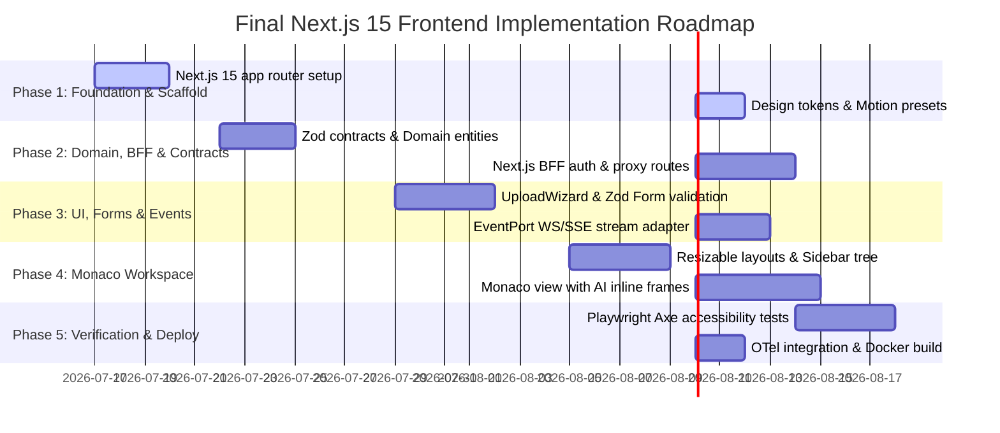

# Enterprise Frontend Architecture & Integration Plan

This document details the production-grade, enterprise-ready Frontend Integration Architecture design for the **Autonomous Code Reviewer AI** dashboard. Designed under strict **Clean Architecture** and **Domain-Driven Design (DDD)** principles, this frontend integrates a **Backend-for-Frontend (BFF)** pattern, built on **Next.js 15 (App Router)** and **TypeScript**.

---

## 1. Executive Summary

This architecture defines the Next.js 15 App Router Frontend for the Autonomous Code Reviewer AI. It introduces a **Backend-for-Frontend (BFF)** layer using Next.js Route Handlers to isolate the browser client from direct interactions with the backend FastAPI engine. By implementing a strict **Clean Architecture** division, runtime **Zod contracts validation**, explicit **DTO-to-Entity mappers**, and **OpenTelemetry browser instrumentation**, the frontend achieves enterprise-grade security, scalability, and resilience.

---

## 2. Architectural Principles

1. **Separation of Concerns**: Business rules remain decoupled from presentation frames, frameworks, and network protocols.
2. **Dependency Inversion (Inward Flow)**: External libraries, HTTP clients, and network configurations are details that implement abstract domain ports.
3. **Fail-Safe Resilience**: Individual features fail independently without crashing the entire developer workspace.
4. **Security by Design**: Complete sanitization of inputs, memory-only state tokens, and secure HttpOnly cookie management.

---

## 3. Clean Architecture Diagram

The system enforces clear boundaries, isolating the browser, Next.js BFF proxy, and the FastAPI engine:

```text
 +─────────────────────────────────────────────────────────────────────────────+
 |                              BROWSER RUNTIME                                |
 |                                                                             |
 |  [Presentation Layer]                                                       |
 |    Pages (Next.js App router views)                                         |
 |      └─ Features (e.g., Code Review workspace view)                         |
 |           └─ Widgets (e.g., File Explorer, Queue metrics)                   |
 |                └─ Components / UI Primitives (shadcn/ui)                    |
 |                                                                             |
 |  [Application Layer]                                                        |
 |    Custom React Hooks (TanStack Query Server State)                         |
 |    Global Zustand UI Stores & Context Providers                             |
 |                                                                             |
 |  [Domain Layer (Inward Port Core)]                                          |
 |    Entities (Repository, Report, Issue, CostMetric)                         |
 |    Port Contracts (IApiPort, IEventPort)                                    |
 |                                                                             |
 |  [Infrastructure Layer (Adapters)]                                          |
 |    RestApiAdapter (communicates to Next.js BFF)                             |
 |    WebSocketEventAdapter / PollingEventAdapter                              |
 +──────────────────────────────────────┬──────────────────────────────────────+
                                        │ HTTPS Requests (Correlation ID / CSRF)
                                        ▼
 +─────────────────────────────────────────────────────────────────────────────+
 |                       NEXT.JS BACKEND-FOR-FRONTEND (BFF)                    |
 |                                                                             |
 |  [Route Handlers / Middleware]                                              |
 |    * Validates requests with Zod contracts                                  |
 |    * Handles JWT decryption, refreshes, and HttpOnly cookies                |
 |    * Normalizes backend responses & maps errors                             |
 +──────────────────────────────────────┬──────────────────────────────────────+
                                        │ Private Network API Calls
                                        ▼
 +─────────────────────────────────────────────────────────────────────────────+
 |                       FASTAPI APPLICATION SYSTEM ENGINE                     |
 |    * Runs Repository Orchestrator, Parser, Embeddings, LLM Agents           |
 +─────────────────────────────────────────────────────────────────────────────+
```

---

## 4. Dependency Rules

- **Strict Inward Direction**: Inner circles (Domain, Contracts) have no dependencies on outer layers (Infrastructure, Presentation).
- **Compile-Time Enforcement**: Zod contracts and domain type definitions are written in pure TypeScript. No React components or Next.js route handlers can be imported into the `src/domain/` namespace.
- **Port Abstractions**: External connections (HTTP libraries, event streams) are consumed by the UI strictly through domain interfaces, resolving implementations at runtime.

---

## 5. Folder Structure

We organize by **Feature-Based Modules** to ensure modularity and maintainability:

```text
src/
├── app/                        # Next.js App Router (Pages, Layouts, BFF APIs)
│   ├── layout.tsx              # Root Layout (Injects global providers, fonts)
│   ├── page.tsx                # Landing router (redirects to /dashboard)
│   ├── api/                    # Backend-for-Frontend (BFF) Route Handlers
│   │   ├── auth/               # BFF Cookie-to-FastAPI login/refresh proxy
│   │   ├── analyses/           # Repository analysis submission proxy
│   │   └── reports/            # Report downloader and visualizer proxy
│   └── dashboard/              
│       ├── page.tsx            # Dashboard home page
│       ├── analysis/[id]/      # Live progress tracking page
│       ├── reports/[id]/       # Interactive code review workspace
│       └── layout.tsx          # Collapsible sidebar grid workspace shell
│
├── contracts/                  # API Contracts Layer (BFF & Client Validation)
│   ├── auth.contract.ts        # Request/Response schemas for authentication
│   ├── analysis.contract.ts    # Request/Response schemas for analysis jobs
│   ├── reports.contract.ts     # Request/Response schemas for reviews & diffs
│   └── users.contract.ts       # User identity contract shapes
│
├── domain/                     # Pure Enterprise Business Rules
│   ├── entities/               # Core domain objects (Repository, Report, Issue, User)
│   ├── value_objects/          # Immutable values (CostMetric, LanguageDistribution)
│   ├── ports/                  # Interface contracts (IApiPort, IEventPort)
│   ├── exceptions/             # Domain validation and execution errors
│   └── validation/             # Zod domain validators
│
├── services/                   # Infrastructure / Service adapters (Ports implementations)
│   ├── api/                    # Base ApiClient config (Axios settings, request tracking)
│   │   ├── mappers/            # explicit DTO-to-Domain Entity mappers
│   │   └── RestApiAdapter.ts   # Rest client implementing IApiPort
│   ├── auth/                   # Client-side JWT memory session adapters
│   └── events/                 # Real-time event streams (SSE/WS/Polling)
│
├── features/                   # Self-contained business features
│   ├── dashboard/              # Submission wizard & dashboard stats
│   ├── analysis/               # Logs consoles, linear status pipelines
│   ├── reports/                # Monaco viewports, diff comparison widgets
│   └── auth/                   # Credentials login, token hooks, protection guards
│
├── widgets/                    # Reusable dashboard cards and blocks
│   ├── MetricGridWidget.tsx    # Workspace score & issue breakdown stats
│   ├── HealthStatusWidget.tsx  # Telemetry indicator checks
│   └── QueueOverviewWidget.tsx # Live background worker queues status
│
├── components/                 # Shared presentation layer elements
│   ├── ui/                     # shadcn/ui components (radix-based)
│   └── feedback/               # Skeletons, Error boundaries, Empty states
│
├── providers/                  # Application wrappers injecting contexts
│   ├── QueryProvider.tsx       # TanStack Query client wrapper
│   ├── ThemeProvider.tsx       # next-themes context (Light/Dark/System)
│   ├── SessionProvider.tsx     # Current user & auth session manager
│   ├── ShortcutProvider.tsx    # Hotkey trigger registry
│   └── PaletteProvider.tsx     # Ctrl+K visual command palette launcher
│
├── stores/                     # Zustand global stores (UI variables only)
│   ├── useUIStore.ts           # Workspace sidebars, resizable layouts dimensions
│   └── useWorkspaceStore.ts    # Temporary code states, active file nodes
│
├── hooks/                      # Shared hooks (useDebounce, useIntersectionObserver)
├── styles/                     # Tailwind index.css stylesheet
│   └── globals.css             # Base design tokens
│
├── types/                      # Global type definitions (shared)
├── config/                     # Environment variable validation structures
└── lib/                        # Third-party wrappers (cn, tailwind-merge)
```

### Dependency Rules:
- **Shared Layer** (`components`, `providers`, `hooks`, `lib`, `styles`, `types`) has no feature dependencies.
- **Widgets Layer** integrates shared components and domain items into high-level cards.
- **Features Layer** handles specific business workflows, incorporating widgets and components.
- **Pages (App Router)** serve as entry points, importing features, widgets, and layouts.

---

## 4. Dependency Direction Diagram

All dependency arrows point inward, ensuring the core Domain remains free of external dependencies.

```text
 +-------------------------------------------------------------------------------+
 | Infrastructure / Services Layer (Axios Client, SSE Events, next-themes)       |
 +--------------------------------------+----------------------------------------+
                                        |
                                        v Implements
 +-------------------------------------------------------------------------------+
 | Domain Layer (Ports, Entities, Value Objects, Zod Validators)                 |
 +--------------------------------------+----------------------------------------+
                                        ^
                                        | Consumes (via custom query hooks)
 +-------------------------------------------------------------------------------+
 | Application Layer (TanStack Query, Zustand Stores, Shortcut Providers)       |
 +--------------------------------------+----------------------------------------+
                                        ^
                                        | Invokes
 +-------------------------------------------------------------------------------+
 | Presentation Layer (Pages, Features, Widgets, UI Components)                  |
 +-------------------------------------------------------------------------------+
```

---

## 5. Service Architecture

React components are decoupled from specific protocol integrations (e.g. Axios, WebSocket). Communication occurs through abstract ports resolved dynamically.

```text
    [Presentation: React UI]
              │
              ▼ Calls
     [Application Hooks] (e.g., useReport)
              │
              ▼ Consumes
       [Domain API Port] (e.g., IReportPort)
              │
              ├───────────────────────────────┐
              ▼ Implements                    ▼ Alternative Mock
    [RestReportAdapter (Axios)]     [MockReportAdapter (MSW/Local)]
```

- **Axios Adapter Isolation**: Imports of `axios` occur only inside `/services/api/`. Endpoint wrappers (`RestAnalysisService`, `RestAuthService`) implement typed Domain interfaces, preventing Axios dependencies from leaking into components.

---

## 6. Authentication Architecture

Role-Based Access Control (RBAC) is managed on the client side via the `SessionProvider` and `PermissionProvider`:

- **Memory Token Storage**: Access tokens reside exclusively in JavaScript memory, while refresh tokens are stored in secure `HttpOnly`, `SameSite=Strict`, `Secure` cookies to mitigate XSS vulnerabilities.
- **Access Contexts**:
  - `useSession()`: Returns current user authentication state and session timelines.
  - `useCurrentUser()`: Returns active user profiles (avatar, settings preferences).
  - `usePermissions()`: Exposes authorization flags (e.g. `canTriggerAnalysis()`).
- **Route Guards**: Route segments are protected by permission-checking wrappers (`<ProtectedRoute guard="admin">`).

---

## 7. Event Architecture

Real-time telemetry and task updates are abstracted behind an `EventPort` interface. The presentation layer remains agnostic of the underlying network transport (SSE, WebSockets, or long polling):

```typescript
// Domain Port Interface
export interface IEventPort {
  subscribe(channel: string, callback: (event: SystemEvent) => void): () => void;
  unsubscribe(channel: string): void;
}

// System Event Entity
export interface SystemEvent {
  type: "ANALYSIS_PROGRESS" | "WORKER_STATUS_CHANGED" | "NEW_REPORT_ALERT";
  payload: any;
  timestamp: string;
}
```

- **Fallback Cascade**: The infrastructure layer implements `WebSocketEventAdapter` and `SseEventAdapter`. If a connection drop occurs, the system automatically falls back to `PollingEventAdapter` (which triggers REST requests via TanStack Query), keeping the UI uninterrupted.

---

## 8. State Management Strategy

1. **Server State (TanStack Query)**:
   - Manages asynchronous data fetched from FastAPI backend endpoints (e.g., reports, analysis status logs).
   - Handles cache lifetimes, automatic refetching, and polling synchronization.
2. **Global Client UI State (Zustand)**:
   - Restricted to global configuration values: active sidebar toggles, panel layouts, keyboard shortcuts, active themes, and user session scopes.
3. **Local Component State (`useState`, `useReducer`)**:
   - Manages page-level variables (e.g., file search filters, open folders, current file path, local validation statuses).

---

## 9. Routing Strategy

Using Next.js 15 dynamic directory routing:
- **Workspace Layout Shell**: Implements dynamic layouts containing collapsible sidebar panels.
- **Workspace Parallel Panels**: Implements dynamic segments to render resizable sidebar navigation drawers and parallel overlays (e.g. settings modals) without breaking active route page lifecycles.

---

## 10. Security Architecture

- **Content Security Policy (CSP)**: Configure strict CSP rules to restrict script execution, inline styles, and unauthorized network requests.
- **CSP Nonces**: Injects random crypto nonces into dynamically rendered styles and script tags on every server-side request.
- **Trusted Types**: Standardizes sanitization rules on browser-written HTML nodes.
- **Subresource Integrity (SRI)**: Configures integrity hashes for compiled static assets, protecting against tampering.
- **Upload Safety**: The BFF validates ZIP file structure, file counts, and file size limits before forwarding payloads to FastAPI.
- **DOMPurify Sanitization**: Pre-renders code reports and issues text through DOMPurify, mitigating XSS hazards. Buns the use of `dangerouslySetInnerHTML`.

---

## 11. Design System Architecture

Built on **Tailwind CSS** and **shadcn/ui**, the visual system uses a strict layout hierarchy:

```text
  [Design Tokens] (HSL variables, Typography spacing scales, Shadow depths)
         │
         ▼ Configures
  [Radix Primitives] (Accessible buttons, popovers, sheet drawers)
         │
         ▼ Composes
  [Composed Primitives] (Stylized UI cards, dialog sheets, alerts)
         │
         ▼ Assembles
  [Visual Patterns] (Dynamic file navigators, forms grids, charts panels)
         │
         ▼ Bundles
  [Feature Layout Components] (Monaco Editor workspaces, upload forms)
```

- **Clean Boundaries**: Component layout styles rely strictly on CSS parameters and tailwind utility values. UI primitives are independent of business hook definitions.

```css
/* Color Palette Custom Properties */
:root {
  --background: 240 10% 3.9%;      /* Jet Obsidian Background */
  --foreground: 0 0% 98%;          /* Ice White Text */
  --card: 240 5.9% 10%;            /* Slate Card Charcoal */
  --border: 240 3.7% 15.9%;        /* Slate Zinc Border */
  --accent: 200 100% 50%;          /* Cyan Neon Blue Glow */
  --accent-glow: hsla(200, 100%, 50%, 0.15);
  
  --severity-critical: 0 84.2% 60.2%; /* Crimson Red */
  --severity-high: 24 9.8% 50%;       /* Safety Orange */
  --severity-medium: 48 96% 53%;      /* Amber Yellow */
}
```

---

## 12. Motion Architecture

Animations use Framer Motion and are managed through centralized motion configurations:

- **Centralized Tokens**: Transition presets, duration variables, and easing scales are defined in `src/shared/theme/motion.ts`.
- **Transitions scale**: Consistent delay times (e.g. 100ms for hover reactions, 200ms for panel slides).
- **Framer Motion Presets**: Reusable transition variants (`fadeScale`, `slideInFromLeft`) are configured globally, keeping visual transitions consistent.

---

## 13. Accessibility Architecture

Designed to meet WCAG 2.1 AA standards:
- **Skip Links**: Accessible focus bypass structures allowing screen reader users to skip sidebar menus and focus directly on main page contents.
- **Focus Management**: Enforces visible focus rings on all interactive components (`focus-visible:ring-2`).
- **Focus Trapping**: Uses Radix UI primitives to trap keyboard focus inside modals and dropdown sheets.
- **Reduced Motion**: Respects browser motion preferences (`motion-safe:` styling tags and custom Framer Motion variants checking user preferences).
- **Tab Ordering Strategy**: Enforces logical, structured tab indices across layouts.

---

## 14. Offline & Resilience Architecture

The application handles connectivity drops gracefully without losing session data:

- **Offline Indicator Banner**: Instantly notifies users of network interruptions.
- **Resilient Upload Queue**: Interrupted repository uploads are paused and retried automatically when connectivity is restored using chunked retry mechanics.
- **TanStack Query Refetching**: Implements exponential backoff retry delays on queries during network drops, resuming queries once online.
- **Local Cache Persistence**: Saves active settings configurations to browser storage to maintain layout states.

---

## 15. Performance Strategy

- **Dynamic Page Loading**: Next.js App Router lazy-loads pages dynamically. Heavy dependencies (such as Monaco Editor or Recharts) are loaded with skeleton placeholders.
- **DOM Virtualization**: Virtualized lists render code files and directory listings, preventing performance drops when viewing large repositories.
- **Optimized Memoization**: Use of `useMemo` for sorting and filtering issues prevents redrawing components during user filter selections.

---

## 16. Testing Strategy

Multi-layered verification structure verifying Clean Architecture dependencies:

```text
 +─────────────────────────────────────────────────────────────────────────────+
 | Playwright (E2E Integration Flow Tests & Axe-Core Accessibility Checks)     |
 +──────────────────────────────────────┬──────────────────────────────────────+
                                        │ Runs user scenarios
                                        ▼
 +─────────────────────────────────────────────────────────────────────────────+
 | React Testing Library + MSW (Component & View State Validation)             |
 +──────────────────────────────────────┬──────────────────────────────────────+
                                        │ Intercepts network layer
                                        ▼
 +─────────────────────────────────────────────────────────────────────────────+
 | Vitest (Isolated Domain Logic, Contract Mocks & Hook Calculations)          |
 +─────────────────────────────────────────────────────────────────────────────+
```

- **Contract Tests**: Verify Zod validation schemas against FastAPI JSON payloads.
- **MSW Mocking**: Injects Mock Service Worker APIs to intercept client HTTP requests, enabling predictable offline component tests.

---

## 17. Scalability Strategy

- **Pluggable AI Models**: The API client abstracts model properties. If the user changes providers in the settings panel (e.g. switching from Claude to GPT), the report rendering code adapts automatically.
- **Multi-Tenant Organization Structure**: Root layouts fetch workspace parameters. Routing layouts structure organization paths dynamically (e.g., `/org/:orgId/dashboard`), enabling seamless workspace switching without core rewrites.
- **Pluggable AI Extensions**: Extensible layout registers permit features like inline AI chats to mount next to the Monaco editor view as simple modular wrappers.

---

## 18. Risk Analysis & 19. Mitigation Strategy

| Identified Risk | Impact | Architectural Mitigation |
| :--- | :--- | :--- |
| **Monaco Memory Bloat** | Heavy memory usage when opening large repositories. | Implement lazy unloading for inactive editor tabs, using virtual line buffers. |
| **JWT Cookie Theft via CSRF** | Malicious requests executing on behalf of an authenticated user. | Configure strict `SameSite=Strict` browser flags on cookies, combined with anti-CSRF request headers. |
| **Frequent DB Polling Overhead** | High query load on backend databases during analysis. | Implement client-side adaptive backoff polling (e.g., backoff polling increments from 2s to 8s if state updates remain unchanged). |

---

## 20. Implementation Roadmap



---

## 21. Verification Plan

### Automated Verification
```bash
# 1. Run Vitest unit & contract validations
npm run test:unit

# 2. Run Playwright E2E visual & accessibility audits
npx playwright test

# 3. Compile Production Bundle check
npm run build
```

### Manual Verification
- Resize the browser viewport from mobile width (320px) to desktop (2560px) to verify responsive scaling.
- Run Lighthouse audits on the report page to verify WCAG AA color contrast and loading speed.
- Verify CSRF security by intercepting and modified request headers during uploads.
